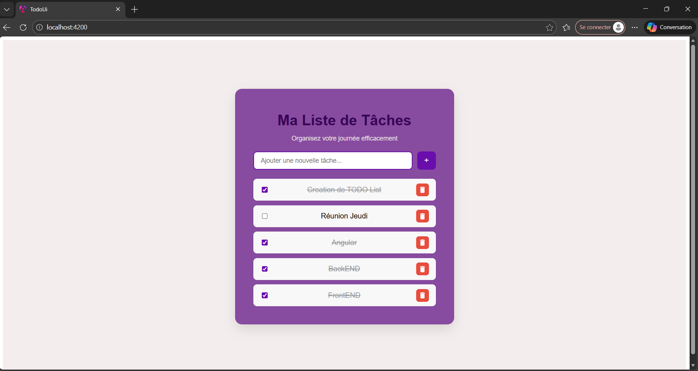
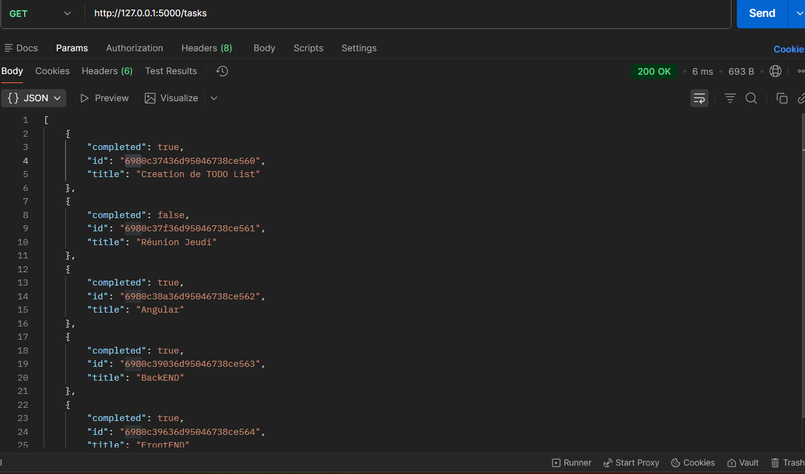
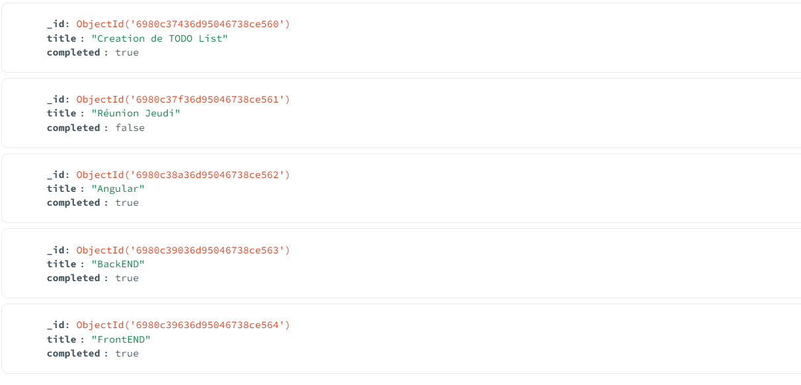

# My ToDo Project

Petit projet **Fullstack** pour apprendre à lier **Angular** et **Flask** avec une base **MongoDB**.  
Le frontend utilise un design inspiré du **Glassmorphism**.

---

## Fonctionnalités

- Ajouter, modifier et supprimer des tâches.
- Stockage des données avec **MongoDB**.
- Interface **Angular** moderne et réactive.
- API REST avec **Flask**.

---

## Prérequis

Assurez-vous d'avoir installé sur votre machine :

- [Python](https://www.python.org/downloads/)
- [MongoDB](https://www.mongodb.com/try/download/community)
- [Node.js](https://nodejs.org/)
- [Angular CLI](https://angular.io/cli)

---

## Lancer le projet

Le projet est composé de deux parties : **Backend** et **Frontend**.  

### 1. Backend

Ouvrez un terminal et exécutez :
### 1. Backend

Ouvrez un terminal et exécutez :

```bash
cd backend
pip install flask flask-cors pymongo
python app.py
```
### 2. Frontend

Ouvrez un autre terminal et exécutez :

```bash
cd frontend
cd frontend
npm install
ng serve
```
## Captures d'écran

### 🖼️ Interface Angular


---

### 🔄 Test de l’API avec Postman


---

### 🗄️ Données dans MongoDB



